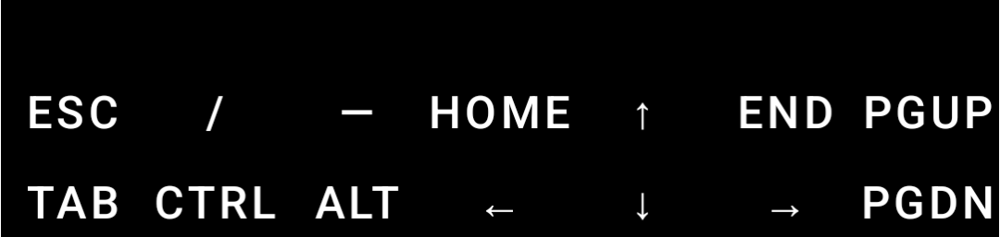
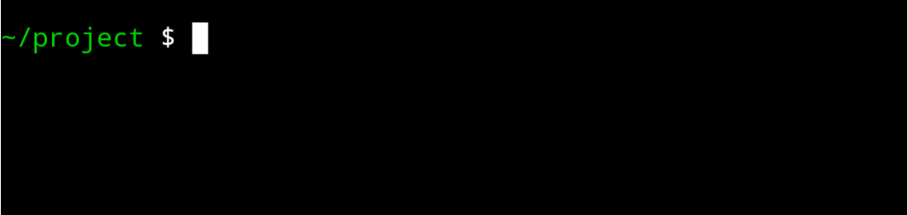
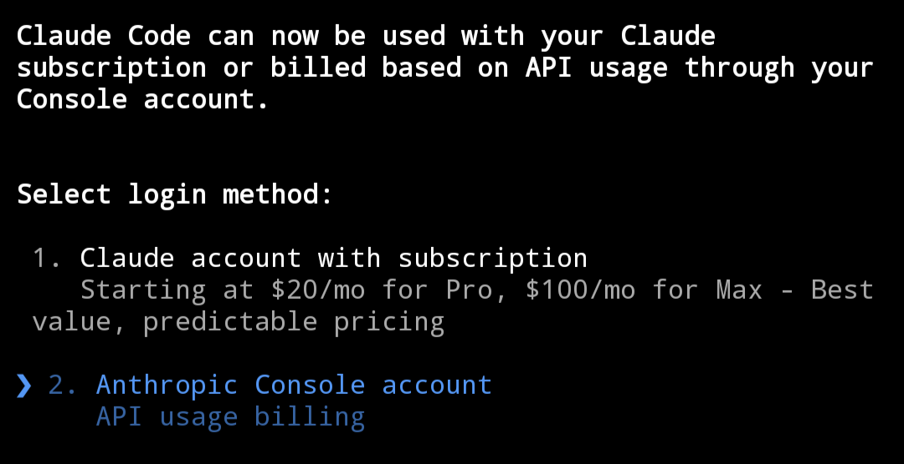
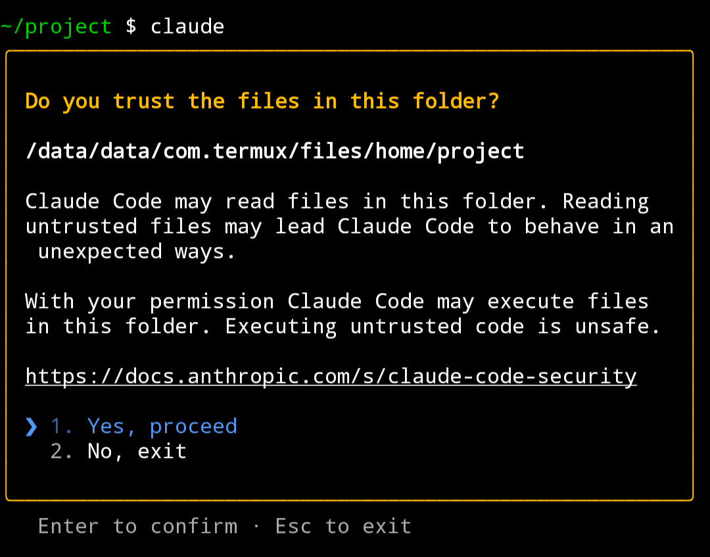
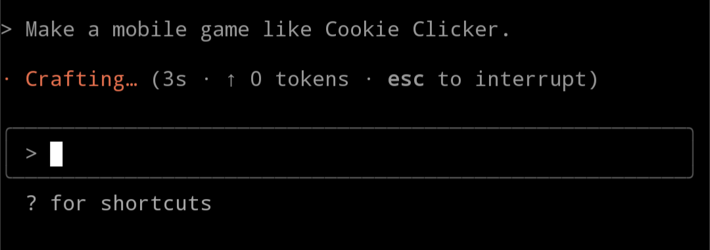
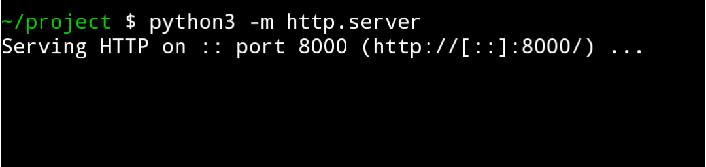
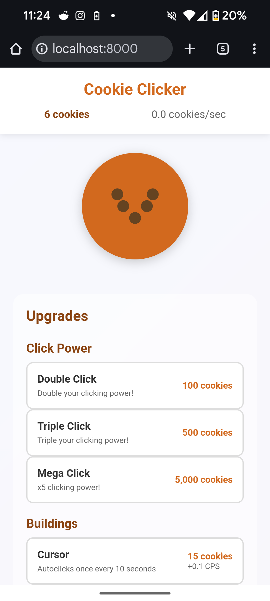

## Overview

Required skills: no programming, but experience with a Linux terminal is going to help a lot.

Required time: 30 minutes

Required money: $10 USD

Required materials: Android phone.

This tutorial will show you how to use Claude to generate interactive games, apps, and websites on your Android phone so you can build & play on the go.  P.S. I think AI is cool, but I wrote this article myself.

Here is a mobile game I built on my phone: [Shape Survivors 2](https://stickyfingies.github.io/square-game-2)

## Download Termux

Android is based on Linux, a powerful open-source operating system.  Using a terminal emulator called [Termux](https://play.google.com/store/apps/details?id=com.termux&hl=en_US&pli=1), we can give commands to Linux and make it do things for us.

## Download Base Packages

Open Termux and above your keyboard there should be two rows of buttons.

Swipe the entire button section to the left (<--).  You should now see a familiar textbox with a blinking cursor located right above your keyboard.

One-by-one, copy the following 4 commands to your clipboard and paste them into Termux by holding your finger on the textbox and tapping "paste".  Then, hit `enter` twice to run the command.

- `pkg upgrade`
- `pkg install nodejs python git gh ripgrep termux-api tree`
- `mkdir -p ~/project`
- `cd ~/project`

If you see the following text at the top of your screen, then you succeeded.  It is also okay to restart from the top if you think you made a mistake.

Great job!  So far, you've downloaded some required open-source software that we're going to use to build apps.  You've also created a folder called "project" where all the source code for your app or game is going to live.

## Set up Claude Code

Now we are going to download Claude Code, a ridiculously sophisticated and capable tool for coding that runs in the Linux terminal.  Don't worry - you don't need to know how to code.

Run the following commands, the same as before:

- `npm install -g @anthropic-ai/claude-code`
- `claude`

After running `claude`, pick a theme (dark mode is best) and then pick "Anthropic Console account" unless you already have a monthly subscription.

Use your browser to create an account and put some moolah in there.  I think the minimum is either $5 or $10, which are both sufficient to have some fun.

Next, Claude is going to ask your permission to do work inside the project folder.

It is safe to proceed because we know the folder is empty and does not contain anything malicious - we just made it ourselves!

Now is the exciting part - you can ask Claude to do anything!  For example:

Claude will break the prompt down into tasks, and implement them one-by-one using code.

It may occasionally ask you to review some code it writes or commands it wants to execute.  If you're not sure whether something is safe, be sure to **google it** or **ask claude** to explain what it's doing.

Once Claude is done coding, follow these instructions to see what it made:

- Type `/exit` and hit enter to leave Claude Code
- Type or copy `python3 -m http.server` into the Linux terminal

This will create a URL for the website Claude just made, probably something like `localhost:8000`.

Open this URL in the web browser, and have fun!  Here's what Claude made on my Pixel 8a using the prompt from the screenshot above:

Thank you!  Happy crafting!